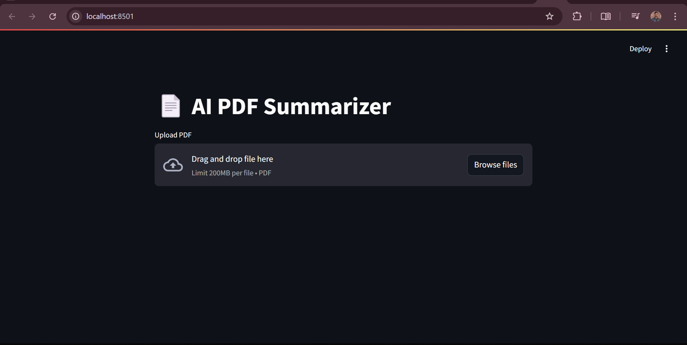

# PDF Summarizer with T5-small

A lightweight PDF summarization tool using Hugging Face's T5-small model, with Flask backend and Streamlit UI.

## Features

- 📄 Extract text from PDFs using `pdfplumber`
- ✨ Summarize content using T5-small transformer model
- 🌐 Flask REST API backend
- 🖥️ Streamlit web interface
- ⚡ Optimized for CPU-only environments

 <!-- Main screenshot showing the interface -->
 <!-- Screenshot showing a summary result -->

## Installation

1. Clone the repository:
```bash
git clone https://github.com/yourusername/pdf-summarizer.git
cd pdf-summarizer
